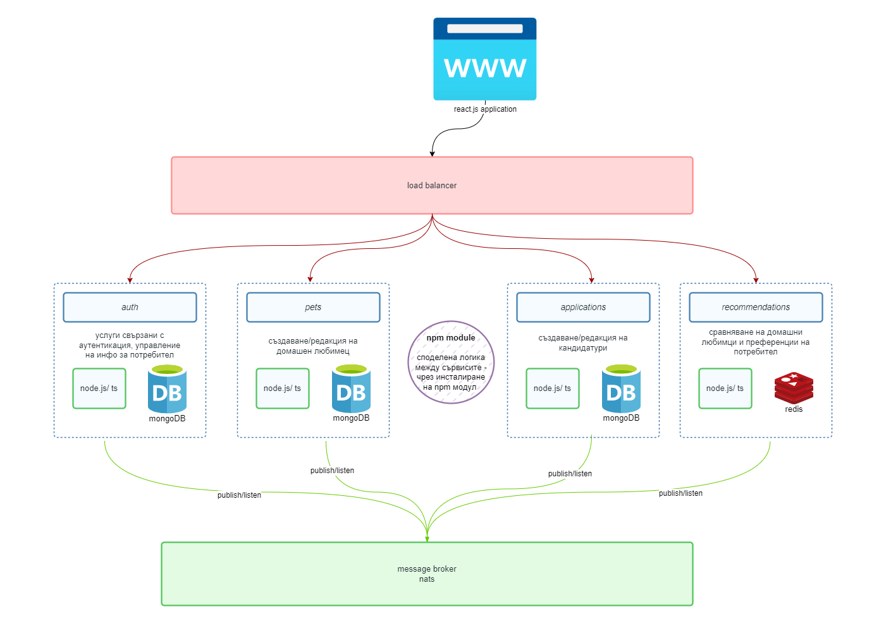
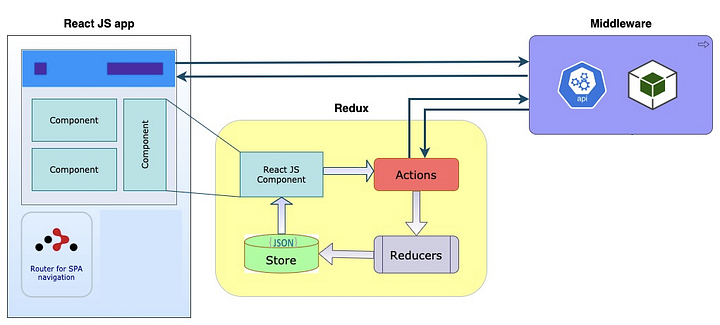

# Give A Paw (Дай лапа) - Pet Adoption Platform

Give A Paw, a comprehensive pet adoption platform that aims to connect pets with loving homes. This project is the result of extensive research, analysis, and individual exploration of various technologies and approaches, including microservices architecture, event-driven approach, content-based filtering algorithms, and more.

## Table of Contents

1. [Introduction](#introduction)
2. [Architecture](#architecture)
3. [Back-end development](#backend)
4. [Front-end development](#frontend)
5. [Recommendation Engine](#recommendation-engine)
6. [Infrastructure](#infrastructure)
7. [Prerequisites](#prerequisites)
8. [Running the Application](#running-the-application)
9. [Tests](#tests)
10. [Deployment](#deployment)
11. [Contribution](#contribution)

## Introduction

Give A Paw is a full-stack application designed to facilitate pet adoption. Its standout feature is a sophisticated recommendation engine that leverages content-based filtering algorithms. This engine connects users and pets, providing personalized recommendations for the best matches.

## Architecture

The project adopts a microservices architecture with event-driven patterns. Four services - `auth`, `pets`, `applications`, and `recommendations` - communicate via NATS messaging. These services share common logic through the `common` module, an npm package containing abstract shared functionalities. The services, built using TypeScript, Node.js, Express, Redis, and MongoDB, can evolve independently and use TDD principles.

## Back-end development

### Auth Service

The Auth Service is a crucial component of Give A Paw, responsible for user authentication and authorization. This service plays a central role in user interactions and ensures a secure and seamless experience within the platform.

#### Functionality

- **Authentication and Authorization:**

  - Implements user authentication and authorization.
  - Publishes to the `preferences:updated` event, signaling changes in user preferences.
  - Does not listen for any specific events, as its primary focus is on user-related operations.

- **Routes and Functionalities:**

  - Provides essential routes for user management, including:
    - Sign-in
    - Sign-up
    - Sign-out
    - Preferences management
    - Favorites management
    - Other user-related functionalities

- **User Access Levels:**
  - Manages two types of users with different levels of access:
    - **User:** Can add pets, apply for pets, and perform standard user functions.
    - **Admin:** Approves or declines/archives pet applications, with broader access rights.
- **Visibility Control:**

  - Only approved pets are visible to users. This enhances the user experience by ensuring that only pets available for adoption are showcased.

- **JWT Authentication:**

  - Implements authentication using JSON Web Tokens (JWT) stored as a cookie. This secure method of user authentication enhances the overall platform security.

- **Common Module Integration:**
  - Utilizes the common module and common middlewares to facilitate seamless integration with other services. This ensures consistent and secure user authentication and authorization across all services.

#### User Types and Access Levels

1. **User:**

   - Can add pets to the platform.
   - Can apply for pet adoption.

2. **Admin:**
   - Approves or declines/archives pet adoption applications.
   - Has broader access rights for administrative functions.

#### Event Publishing

- Publishes to the `preferences:updated` event, indicating changes in user preferences. This event-driven approach enables real-time updates and interactions across the platform.

#### Authentication Flow

1. User Sign-in
   - Users can sign in using secure authentication mechanisms.
2. User Sign-up
   - New users can sign up, creating an account within the platform.
3. User Sign-out
   - Provides a secure sign-out mechanism for users.
4. Preferences Management
   - Users can manage their preferences, influencing the recommendation engine.
5. Favorites Management
   - Users can manage their list of favorite pets.

#### Security Measures

- **JWT Cookie:**

  - Utilizes JSON Web Tokens stored as a cookie for secure user authentication.

- **User Authorization:**
  - Through common middlewares, all services, including Auth, can check the user's authorization status, role (user or admin), and ensure a secure interaction.

The Auth Service ensures that user interactions within Give A Paw are secure, efficient, and tailored to individual preferences. By leveraging JWT authentication, event-driven patterns, and common module integration, it plays a vital role in creating a positive and reliable user experience.

### Pets Service

- Manages pet-related operations, including listing and details.

#### Functionality

- **CRUD Operations:**

  - Implements CRUD operations for managing pets, including:

- **Image Storage with Multer:**

  - Uses Multer to handle image uploads, providing a seamless experience for adding pet photos.

- **Event Publishing:**

  - Publishes events to facilitate real-time updates:
    - `pet:created`: Signaling the creation of a new pet.
    - `pet:updated`: Indicating updates to pet information.

- **Recommendation Integration:**

  - Consumes events:

    - `recommendations:generated`: Obtains pet recommendations based on the content-based filtering algorithm.

  - Stores Recommendations:

    - Manages a separate MongoDB collection for storing and retrieving recommendations.

  - Filters Pet Listings:
    - Filters the list of pets based on recommendations if the user is logged in.
    - Displays all active pets if the user is not logged in or if no recommendations are available.

#### Routes and Functionalities

- Pet Listing

  - Retrieves a list of active pets.
  - Supports filtering by type, color, size, etc.

- Pet Details

- Pet Creation

- Pet Update

- Pet Deletion

#### Recommendation Integration

- **Recommendation Event Consumption:**

  - Consumes the `recommendations:generated` event to obtain personalized recommendations for pets.

- **Recommendation Storage:**
  - Manages a dedicated MongoDB collection for storing and retrieving recommendations.

#### User-Based Pet Filtering

- **User Authentication Check:**

  - Checks if the user is logged in using the common module.

- **Filtering Logic:**
  - Filters pet listings based on recommendations for logged-in users.
  - Displays all active pets if the user is not logged in or if no recommendations are available.

#### Security Measures

- **JWT Authentication:**

  - Utilizes JSON Web Tokens (JWT) for user authentication again using the common module.

- **Authorization Check:**
  - Ensures that only authorized users can perform CRUD operations on pets.

The Pets Service enhances the Give A Paw platform by facilitating seamless pet management operations, integrating recommendation algorithms for a personalized user experience, and ensuring secure and efficient image uploads using Multer.

### Applications Service

The Applications Service is responsible for managing pet adoption applications within the Give A Paw platform. While it is considered the least stable service in the project at the moment, it plays a crucial role in facilitating communication between applicants and pet owners.

#### Functionality

- **Application Management:**

  - Provides functionality to apply for pet adoption.
  - Allows pet owners to approve or decline applications.

- **Communication:**

  - Facilitates communication between applicants and pet owners, ensuring the exchange of essential information.

- **Event Handling:**

  - Publishes events:

    - `application:created`: Signals the creation of a new adoption application.
    - `application:approved`: Indicates the approval of a pet adoption application.
    - `application:cancelled`: Notifies the decline of a pet adoption application.

  - Consumes events:
    - `pet:created`
    - `pet:updated`

#### Routes and Functionalities

- Application Submission
- Application Approval
- Application Decline

#### Communication Features

- **Applicant-Pet Owner Communication:**
  - Provides a messaging platform (not fulli implemented atm) for communication between applicants and pet owners.

#### Event Handling Issues

- **Current Stability:**

  - Acknowledged as the least stable service in the project.

- **Publishing Events:**

  - Publishes events but may not be working optimally at the moment.

#### Security Measures

- **Authorization Check:**
  - Ensures that only authorized users can perform application-related operations.

#### Future Development Focus

While the Applications Service may be the least stable in the current state of the project, future development efforts can focus on enhancing its reliability and functionality. By addressing event handling issues and improving communication features, this service can play a more significant role in facilitating successful pet adoptions within Give A Paw.

### Recommendations Service

- Employs content-based filtering to generate personalized pet recommendations. See more [here](#recommendation-engine)

### Common Module Logic

- Abstract shared logic for common functionalities among services. The package is published as an [npm package](https://www.npmjs.com/package/@giveapaw/common). It implements error handling, common interfaces, shared auth logic etc.

## Front-end development

The client, available in the `client` branch, utilizes React, Axios, React Router, Material UI, and Redux for state management. The UI/UX design incorporates custom elements to enhance user experience.

#### Technologies Used

- **React:** The core library for building user interfaces.
- **Axios:** A promise-based HTTP client for making API requests.
- **React Router:** Enables navigation and routing within the React application.
- **Material UI:** A popular React UI framework that provides pre-designed components for a clean and consistent design.
- **Redux:** A state management library for managing application state.

#### UI Design

- **Clean and Intuitive Design:**
  - The UI is designed to be clean and intuitive, enhancing the user experience. The UI project can be found in my personal Behance profile for a detailed look into the design. (soon!)

The frontend development of Give A Paw plays a crucial role in delivering a visually appealing, intuitive, and responsive(partially! this was not the focus of the project) user interface. By leveraging React and a robust ecosystem of libraries, the project aims to provide a seamless and enjoyable experience for users exploring pet adoption on the platform.

## Recommendation Engine

The heart of Give A Paw's intelligence lies in the recommendation engine. By analyzing user preferences and pet characteristics, it provides personalized suggestions for potential matches.

#### Key Features

- **Content-Based Filtering:**

  - Uses content-based filtering to evaluate the match between a user's preferences and a pet's characteristics.

- **Redis Integration:**
  - Stores user and pet data in Redis and updates recommendations when preferences or pet information changes.

#### Route

- **`/match`:**
  - Returns details on the match between a specific pet and a user, including match score and identified matched features.

#### Implementation Approach

- **Event-Driven Updates:**

  - Listens to events like `preferences:updated` and `pet:created`/`pet:updated` for efficient updates.

- **Computational Cost:**
  - Acknowledges the current computational expense but serves as an experiment for personalized recommendations.

#### Future Possibilities

- **Machine Learning Integration:**
  - Future consideration for integrating machine learning frameworks, such as TensorFlow, for advanced recommendation algorithms.

#### Experimentation Results

- **Successful Experiment:**

  - Despite being computationally expensive, the experiment has yielded positive results in providing personalized pet recommendations.

- **Room for Improvement:**
  - Recognizes the experimental nature and potential for optimization in future iterations.

The Recommendation System, while acknowledging its computational expense, serves as an experiment that successfully delivers personalized pet matches based on user preferences. The system remains open to future enhancements and optimizations, including the exploration of advanced machine learning techniques.

## Infrastructure

The microservices communicate via NATS, ensuring efficient event-driven communication. Redis and MongoDB store data, contributing to a scalable and resilient infrastructure.

## Prerequisites

Ensure you have the following installed:

- Node.js
- npm
- Kubernetes
- Docker
- Skaffold

## Running the Application

1. Clone the repository.
2. Navigate to the project root.
   TODO

## Tests

The project initially followed a Test-Driven Development (TDD) approach. However, recent changes lack unit tests, causing some failures. Contributions to address this are welcome.

## Deployment

Follow deployment guidelines in the respective service directories. Ensure proper environment configurations for production.

## Thank you!

Thank you for your interest in making Give A Paw a successful pet adoption platform! Although it will propbably not be used from real users, mostly for learning and exeprimenting 🐾
